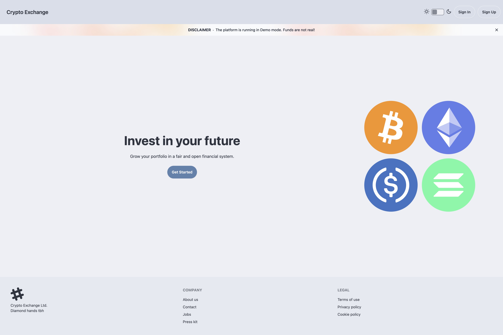
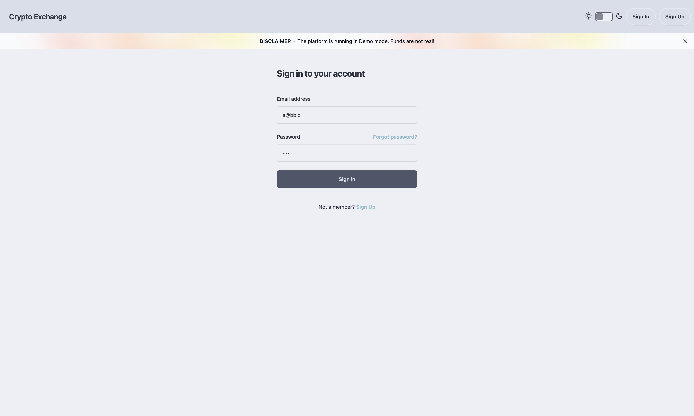
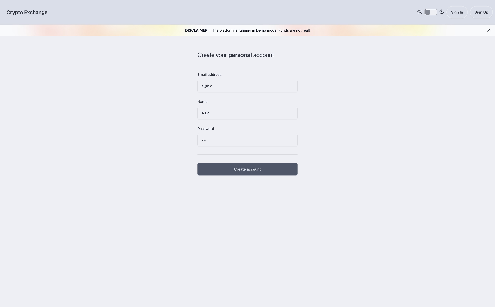

# exchange-orderbook

## Table Of Contents

- [Greetings! 👋](#greetings-)
- [Quick Start](#quick-start)
  - [Prerequisites](#prerequisites)
  - [Compiling from source (without docker)](#compiling-from-source-without-docker)
  - [Running (with docker)](#running-with-docker)
  - [NB: bitcoind initial sync](#nb-bitcoind-initial-sync)
  - [Accessing the exchange](#accessing-the-exchange)
- [Service Architecture](#service-architecture)
  - [High-level breakdown of the services](#high-level-breakdown-of-the-services)
    - [Exchange](#exchange)
    - [NGINX](#nginx)
    - [Postgres](#postgres)
    - [bitcoind (Bitcoin Core)](#bitcoind-bitcoin-core)
    - [bitcoind-grpc-proxy](#bitcoind-grpc-proxy)
- [FAQ](#faq)
  - [What is the license?](#what-is-the-license)
  - [Do I have permission to run this?](#do-i-have-permission-to-run-this)
  - [Why did you write this?](#why-did-you-write-this)
- [Author](#author)
- [Screenshots](#screenshots)
  - [Landing Page](#landing-page)
  - [Sign-In Page](#sign-in-page)
  - [Sign-Up Page](#sign-up-page)
  - [Consumer Dashboard Page](#consumer-dashboard-page)
  - [Admin Page](#admin-page)
  - [Trading Dashboard Page](#trading-dashboard-page)

<!-- on my browser from here you have to scroll down -->

<hr>

# [Greetings! 👋](#table-of-contents)

exchange-orderbook is an implementation of a spot exchange; like Coinbase, Kraken, or Binance supporting Bitcoin (BTC) and Ether (ETH) (NB: crypto is just an implementation detail here that is easier to implement than stocks.)

Backend written in Rust, using Tokio and the Axum web framework, also using postgreSQL via SQLx.

Frontend was made with HTMX, DaisyUI, Tailwind CSS, and SSR with minijinja.

Check out the [screenshots](#screenshots)

# [Quick Start](#table-of-contents)

## Prerequisites

Please ensure you have the following programs installed on the system:

- [Docker](https://docs.docker.com/get-docker/)
- [Docker Compose](https://docs.docker.com/compose/install/)
- [Rust](https://www.rust-lang.org/tools/install)
- [Diesel CLI](https://diesel.rs/guides/getting-started/)
- [Protobuf Compiler](https://grpc.io/docs/protoc-installation/)

## Compiling from source (without docker)

To only build the exchange and grpc-proxy executable binaries:

```
cargo build --release --bins
```

They should be found in `target/release/exchange` and `target/release/bitcoind-grpc-proxy` respectively.

## Running (with docker)

To run the exchange and grpc-proxy it is recommended to use docker-compose:

```
docker compose up -d --build
```

This will start the exchange, nginx, postgres, and bitcoind and bitcoind-grpc-proxy services.

## NB: bitcoind initial sync

It will take some time for the bitcoin core full node to sync with the testnet, this is only a couple hours to a day
depending on your internet connection. If you dont want to wait you can always configure the bitcoind service to use the
regtest network instead of the testnet.

disable or comment out `testnet=1` in `etc/bitcoind/bitcoin.conf` and set `regtest=1` instead.

## Accessing the exchange

Assuming you are using docker to run nginx the website should be available `http://localhost:3000/` you can take a look at the [screenshots](#screenshots) to know what to expect.

# [Service Architecture](#table-of-contents)

The following services can be found in the `docker-compose.yml` file:

* exchange, monolith service providing trading, funding, and account related services via a RESTful webserver API
* NGINX, used for SSL/TLS termination and reverse proxying requests to exchange
* Postgres, Schema migrations are located in the migrations directory and are managed using the diesel migrate tool. To minimize operational risk—such as system downtime, data loss, or state incoherence between replicas—migrations are executed manually.
* bitcoind, a bitcoin core node used for generating addresses and streaming transactions configured to use the testnet
* bitcoind-grpc-proxy, a grpc server to proxy requests to bitcoind written because a well-typed grpc api is much nicer to work with.

## High-level breakdown of the services

### Exchange

The exchange service is a single-process service providing trading, funding, and account related services via a RESTful/Hypermedia-driven webserver.

### NGINX

NGINX serves as the web server and reverse proxy:

- **SSL/TLS Termination**: Handles encryption for secure traffic.
- **Reverse Proxy**: Routes traffic to `exchange` API instances.
- **Future Capabilities**: Potential rate limiting implementation.

### Postgres

The database is a Postgres database. Schema migrations are located in the migrations directory and are managed using the diesel migrate tool. To minimize operational risk—such as system downtime, data loss, or state incoherence between replicas—migrations are executed manually.

### bitcoind (Bitcoin Core)

The best way to interact with the Bitcoin network is to run a full node. It will index, verify, track, and manage transactions and wallets. It will also allow us to generate addresses and off-ramp BTC to users.

### bitcoind-grpc-proxy

The currently existing jsonrpc and bitcoin rpc crates are difficult to use and not fully featured. The bitcoin core code itself is a type of C/C++ I can not navigate very well. So I wrote a grpc proxy to expose a well-typed interface to the exchange service while dealing with the bitcoin core jsonrpc interactions in a separate process.

# [FAQ](#table-of-contents)

## What is the license?

The software is distributed under a Limited Use License Agreement, which grants you a non-exclusive, non-transferable, limited right to access and use the software for educational purposes only. This includes viewing, studying, and manually copying code snippets for personal educational use in non-commercial settings. Any electronic reproduction or reintegration of the code into other software is prohibited without prior written consent. The software may not be used, copied, modified, merged, published, distributed, sublicensed, or sold for any commercial purposes.

It is a pretty restrictive license but that's just to deter anyone that wants to come and exploit source-available code for commercial use to make a quick buck. Please do not feel unwelcomed to rifle through the code out of curiosity or if you have questions to reach out or start a discussion.

## Do I have permission to run this?

Yes, you have permission to run the software on your personal device for educational purposes only. This means you can use the software to learn and understand the coding practices and techniques employed.
However, you are not allowed to use the software for any commercial activities, nor can you modify or distribute the software in any form, whether modified or original.

## Why did you write this?

I wanted to see if I could put one together end-to-end for fun. It is shared publicly to showcase the capabilities and design decisions involved in building a full-stack crypto exchange.
The project is intended to be used as an educational tool to help others understand and gain insights into software development and engineering practices in this specific domain.

# [Author](#table-of-contents)

Any questions about the project should use GitHub discussions.

`mentalfoss@gmail.com`

# [Screenshots](#table-of-contents)

## [Landing Page](#table-of-contents)



## [Sign-In Page](#table-of-contents)



## [Sign-Up Page](#table-of-contents)



## [Consumer Dashboard Page](#table-of-contents)


## [Admin Page](#table-of-contents)


## [Trading Dashboard Page](#table-of-contents)


[tinyvec]: https://docs.rs/tinyvec
[event sourcing]: https://microservices.io/patterns/data/event-sourcing.html
