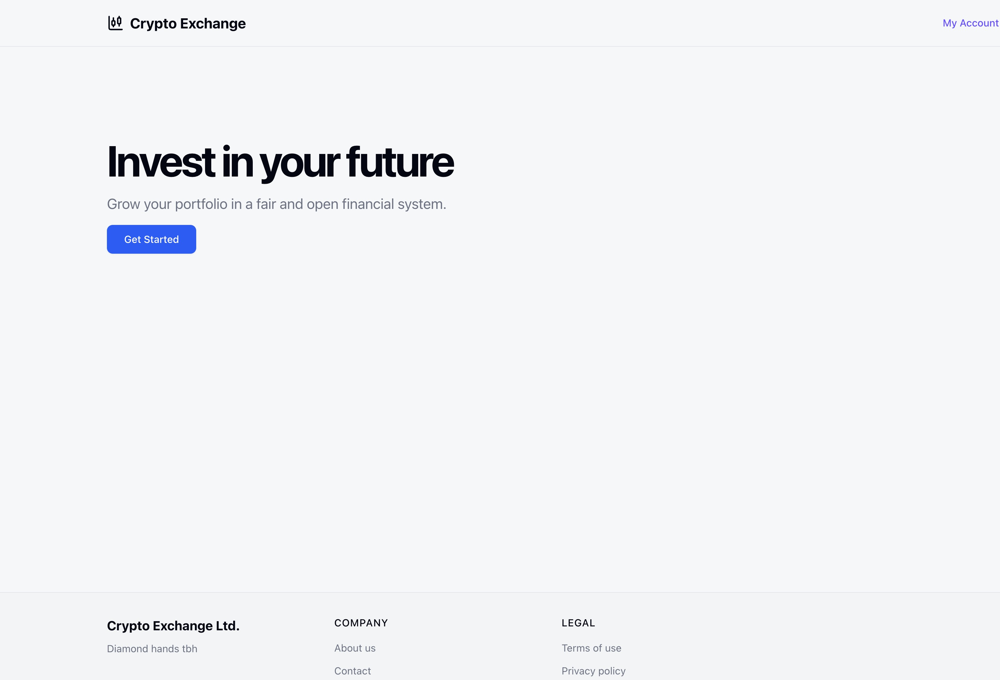
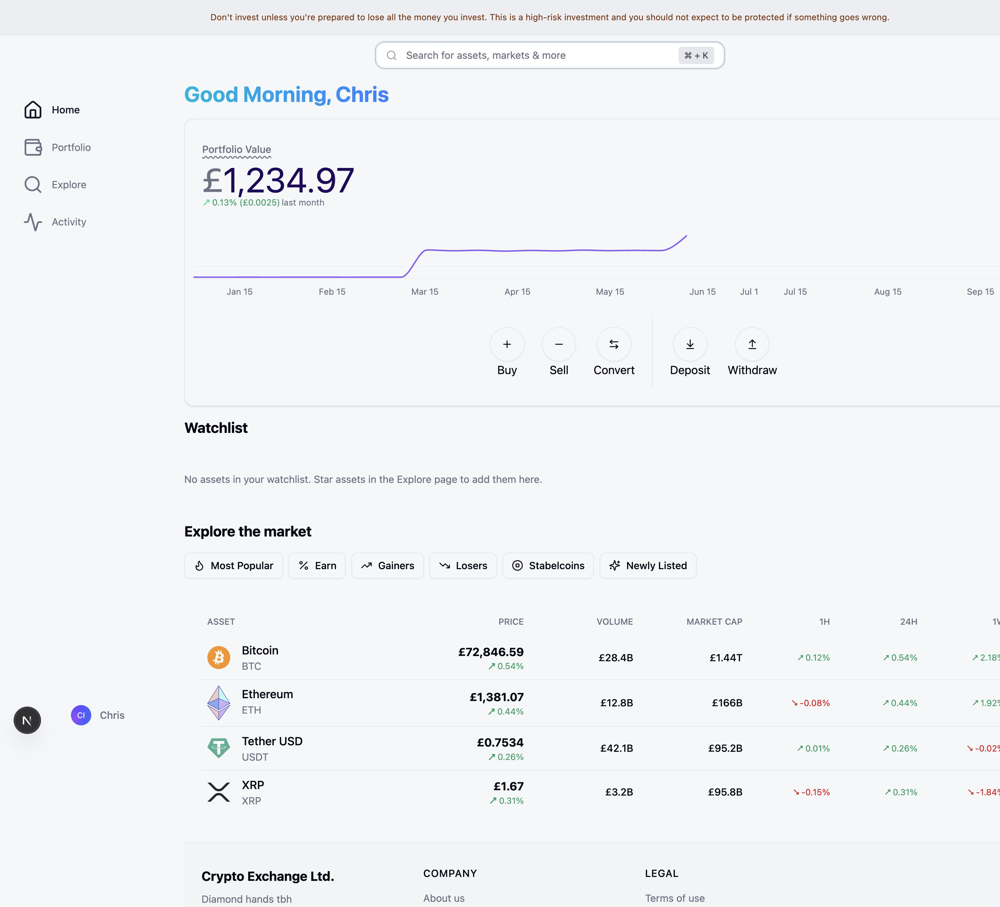

exchange-orderbook is an implementation of a full-stack, [Auction-market](https://www.investopedia.com/terms/a/auctionmarket.asp), spot-exchange; like Coinbase, Kraken, or Binance
supporting Bitcoin (BTC), Ether (ETH), Solana (SOL), and USDC.

The frontend was built using [NextJS](https://nextjs.org/), [TailwindCSS](https://tailwindcss.com), [shadcn/ui](https://ui.shadcn.com/), and [Clerk](https://clerk.com/). The database is [Postgres](https://www.postgresql.org/), for the [matching engine](https://www.investopedia.com/articles/active-trading/042414/youd-better-know-your-highfrequency-trading-terminology.asp#toc-matching-engine), [settlement layer](https://groww.in/p/what-is-trade-settlement), and blockchain integration [Rust](https://www.rust-lang.org/) was used.  Check out the [screenshots](#screenshots)!

_**How do I run this?**_ - `docker compose up` should be enough. See the `docker-compose.yml` file for more details.

_**Why make this?**_ - Fun. I don't get to do a lot of full stack work at `$dayjob` so this is a great way to stretch my virtual legs every once in a while.

_**Do I have permission to run this?**_ - Yes the code here is all MIT licensed.

Use GitHub discussions for questions, otherwise e-mail `mentalfoss+exob@gmail.com`

## Screenshots

